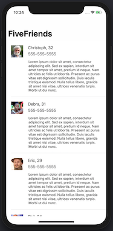

#  FiveFriends

## Running and dependencies

This project uses Cocoapods for managing external libraries. Xcode 10.2 is required. Open `FiveFriends.xcworkspace` and then build and run the current scheme. The `UITableView` displays the initial 5 users. Pull-to-refresh to merge the current set of users with the next set of users.

* Swift 5
* Xcode 10.2
* RxSwift - Reactive extensions implemented in Swift
* RxCocoa - Reactive bindings for Cocoa APIs
* RxTest & RxBlocking - Used for unit tests

## Project Structure

### FiveFriends
The application uses the Model-View-ViewModel pattern for handling responsibilities. RxSwift and RxCocoa is used to handle observations, subscriptions and view binding. 

### FiveFriendsTests
Contains unit tests for decoding responses from the service as well as tests for the ViewModel.

### FiveFriendsUITests
Contains UI tests for the application. 

## Future Improvements

* Add unit tests for `FiveViewController` using `RxTest` and `RxBlocking`.
* Include animations for when new data is available. Consider using `RxDataSources`.
* Move image loading to Model/ViewModel.
* Show message to user if retrieving users fails.
